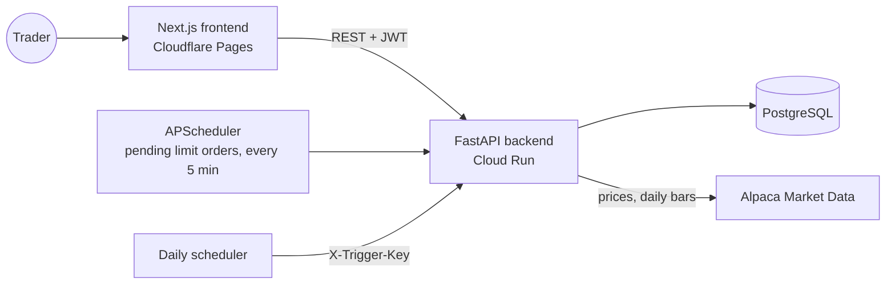

# TradeCraft Simulator

**A paper-trading simulator with real market plumbing.** Register, get $100,000 in virtual cash, and trade US stocks with market and limit orders at live prices from Alpaca. Track your holdings, profit and loss, allocation and value over time, and see the portfolio's historical Value at Risk. Nobody loses real money.

**[Try the live demo](https://tradecraft-simulator.pages.dev/)** (the API sleeps when idle, so the first request can take about 15 seconds).

## Features

- **Accounts:** registration and login with JWT access tokens (30 minutes) and bcrypt-hashed passwords. Every account starts with $100,000.
- **Market data:** latest trade prices and daily bars from Alpaca's IEX feed, cached for 15 minutes and throttled so bursts don't hit Alpaca's rate limits. Alpaca is only a data source; no order ever reaches it.
- **Market orders** fill immediately at the latest trade price.
- **Limit orders** wait as pending orders you can cancel. A background job checks them every 5 minutes and fills each one whose limit price has been reached, at the limit price.
- **Portfolio:** cash, holdings with average cost, current value, unrealized profit and loss, full trade history and a watchlist with current prices.
- **Risk:** one-day historical-simulation Value at Risk at 95% confidence. Today's portfolio weights are applied to each holding's daily returns over the last 252 trading days, and the 5th-percentile loss is reported.
- **Charts:** portfolio value over time from end-of-day snapshots, and an asset-allocation doughnut.

## How it works



- **Orders** go through `trading_service`, which prices them from the market-data service, checks cash or shares, and updates the account, holdings and trade log in one transaction.
- **Snapshots:** a daily scheduler (Google Cloud Scheduler in production) calls `POST /api/v1/portfolio/snapshots/trigger-daily` with a secret `X-Trigger-Key` header to record each account's end-of-day value. The value chart reads those snapshots.
- **Migrations** run automatically: the backend container runs `alembic upgrade head` before starting the server.

## Tech stack

- **Backend:** Python 3.11, FastAPI, SQLAlchemy 2, Alembic, Pydantic 2, alpaca-py, pandas, NumPy, APScheduler, passlib (bcrypt), python-jose.
- **Frontend:** Next.js 15 (App Router), React 19, TypeScript, Tailwind CSS 4, Axios, Chart.js with react-chartjs-2, date-fns, lucide-react.
- **Data and infrastructure:** PostgreSQL 15, Docker Compose locally, Google Cloud Run (API) and Cloudflare Pages (frontend) in production.

## Run it locally

You need [Docker Desktop](https://docs.docker.com/get-docker/) and a free [Alpaca](https://alpaca.markets/) account for market-data keys (paper-trading keys work).

1. **Clone the repository:**

   ```bash
   git clone https://github.com/varunbhandarii/tradecraft-simulator.git
   cd tradecraft-simulator
   ```

2. **Create `backend/.env`:**

   ```env
   DATABASE_URL=postgresql://trading_user:testpass@db:5432/trading_platform_db
   SECRET_KEY=<a long random string>
   ALPACA_API_KEY_ID=<your Alpaca key id>
   ALPACA_API_SECRET_KEY=<your Alpaca secret key>
   FRONTEND_ORIGIN=http://localhost:3000
   SNAPSHOT_TRIGGER_KEY=<another random string>
   ```

   One way to make a random string: `python -c "import secrets; print(secrets.token_urlsafe(32))"`. The database URL matches the Postgres service in `docker-compose.yml`. `FRONTEND_ORIGIN` must be set, or the browser's CORS check blocks the frontend.

3. **Build and start everything:**

   ```bash
   docker compose up --build -d
   ```

4. **Open it:**
   - the app at http://localhost:3000;
   - the API docs (Swagger UI) at http://localhost:8000/docs;
   - Postgres on `localhost:5439` if you want to inspect the data.

5. **Stop it** with `docker compose down`. Add `-v` to delete the database volume too.

To record a snapshot by hand (for the value chart), call the trigger endpoint:

```bash
curl -X POST http://localhost:8000/api/v1/portfolio/snapshots/trigger-daily -H "X-Trigger-Key: <your SNAPSHOT_TRIGGER_KEY>"
```

| Variable | Needed? | Purpose |
|---|---|---|
| `DATABASE_URL` | Yes | PostgreSQL connection string |
| `SECRET_KEY` | Yes | Signs the JWT access tokens |
| `ALPACA_API_KEY_ID`, `ALPACA_API_SECRET_KEY` | Yes, for prices | Alpaca market-data keys |
| `FRONTEND_ORIGIN` | Yes | The frontend's origin, allowed by CORS |
| `SNAPSHOT_TRIGGER_KEY` | For snapshots | Secret the daily scheduler sends in `X-Trigger-Key` |
| `NEXT_PUBLIC_API_BASE_URL` | Frontend build | The API's base URL, ending in `/api/v1`. Docker Compose sets it to `http://localhost:8000/api/v1`. |

## API

All routes are under `/api/v1`. Everything except registration, login and the two admin triggers needs a `Bearer` token.

| Method | Route | What it does |
|---|---|---|
| `POST` | `/auth/register` | Create an account |
| `POST` | `/auth/token` | Log in and get a JWT |
| `GET` | `/users/me` | The logged-in user |
| `GET` | `/market/price/{symbol}` | Latest price for a symbol |
| `POST` | `/trading/orders` | Place a market or limit order |
| `GET` | `/trading/orders/pending` | List pending limit orders |
| `DELETE` | `/trading/orders/pending/{order_id}` | Cancel a pending order |
| `POST` | `/trading/orders/check` | Run the pending-order check now (admin, no login) |
| `GET` | `/portfolio` | Cash, holdings, values and profit and loss |
| `GET` | `/portfolio/trades` | Trade history |
| `GET` | `/portfolio/risk/var` | Historical Value at Risk |
| `GET` | `/portfolio/value-history` | End-of-day value snapshots |
| `POST` | `/portfolio/snapshots/trigger-daily` | Record today's snapshots (needs `X-Trigger-Key`) |
| `GET`, `POST` | `/watchlist` | List or add watchlist symbols |
| `DELETE` | `/watchlist/{symbol}` | Remove a symbol from the watchlist |

## Deployment

- **Backend:** the `backend/` Docker image runs on Google Cloud Run. The entrypoint runs migrations, then starts Uvicorn on Cloud Run's `$PORT`. Set the variables above as environment variables or secrets, with `FRONTEND_ORIGIN` set to the frontend's public origin.
- **Frontend:** Cloudflare Pages builds `frontend/` with `NEXT_PUBLIC_API_BASE_URL` pointing at the Cloud Run service.
- **Daily snapshots:** a Cloud Scheduler job calls the snapshot trigger once a day with the `X-Trigger-Key` header.

## Project layout

| Path | What it is |
|---|---|
| `backend/app/api/endpoints/` | Routes: auth, users, market, trading, portfolio, watchlist |
| `backend/app/services/` | Trading, market data (Alpaca, cache, throttle), portfolio, risk (VaR), snapshots, watchlist |
| `backend/app/models/`, `backend/app/crud/`, `backend/app/schemas/` | Database models, data access and API schemas |
| `backend/alembic/` | Database migrations |
| `frontend/src/app/` | Pages: home, login, register, portfolio, trades |
| `frontend/src/components/` | Portfolio, trading, watchlist and auth components |
| `frontend/src/services/` | Typed API clients |
| `docker-compose.yml` | Postgres, backend and frontend for local development |
